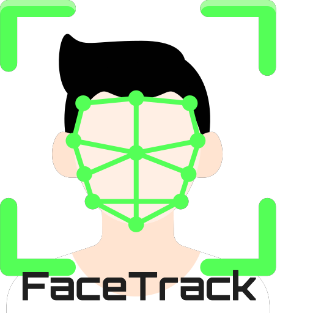

<h1 style="text-align:center">FaceTrack</h1>

<h2 style="text-align:center">Control de asistencia mediante reconocimiento facial</h2>

FaceTrack permite llevar un control de asistencía de los empleados de una empresa de manera
automatizada usando reconocimiento facial. Registrando en un archivo el nombre y hora de 
entrada de cada empleado. A su vez realiza una foto de la entrada de cada empleado.

### Preparativos

- Colocar en la carpeta 'Empleados' una foto de cada empleado del que se va a llevar un registro.
 
 
- Las fotos deben estar hechas de frente y con toda la cara del empleado visible 
(sin gafas de sol, gorras, mascarillas...).
 
 
- Si el empleado lleva gafas de sol regularmente, puede llevarla en la foto de control.
 
 
- La foto debe guardarse con el nombre del empleado y en formato JPG. Ejemplo: 'Victor Costa.jpg'.
 
 

### Información adicional

- Cada día el software creará una carpeta nombrada con la fecha del día donde guardar el registro 
del día y las fotos de entrada los empleados.
 
 
- El programa generará una entrada de registro y una foto a la entrada del empleado solo una vez por día.
Si el empleado vuelve a pasar delante de la cámara una vez se haya registrado su entrada
no se generarán nuevos registros, ya que se considera que ya está trabajando.
 
 

### Instrucciones

- Ejecutar el programa.
 
 
- Se necesita una cámara, smartphone o webcam conectada al equipo.
 
 
- Orientar la cámara de manera que esta pueda reconocer al los empleados.
 
 
